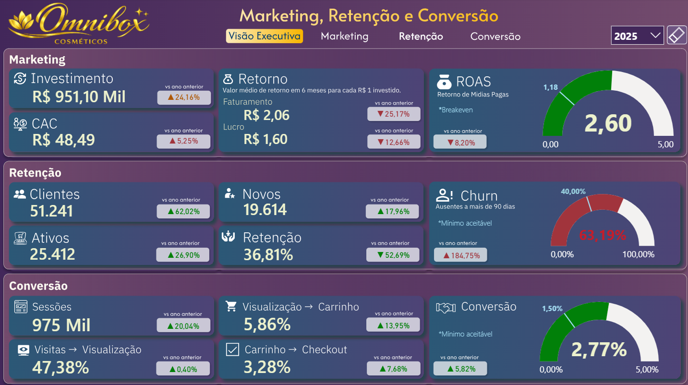
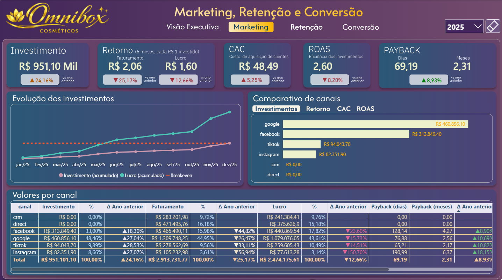
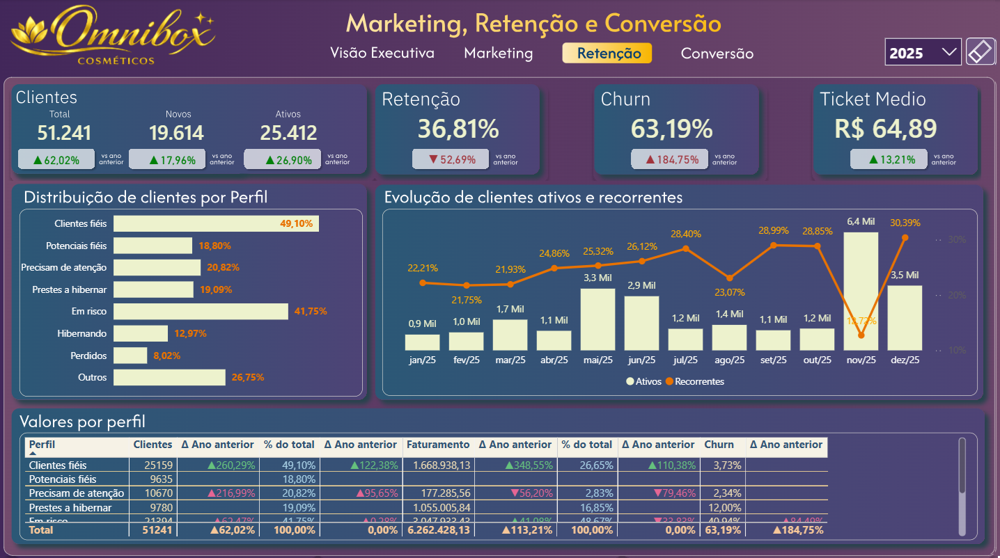
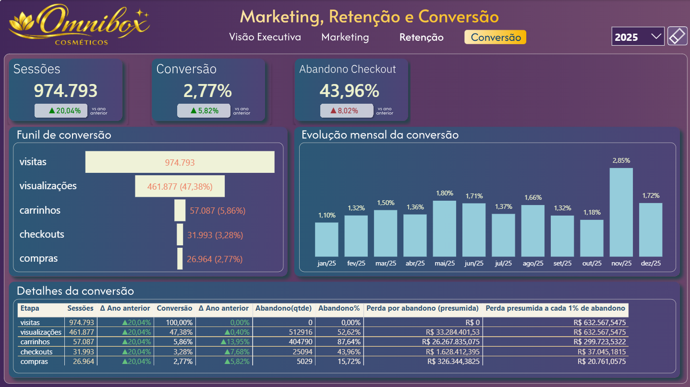

# Customer Lifecycle Analytics (CLA) para e-commerce de cosméticos
Autor: Sergio Ribeiro Cerqueira   
Contato: sergio.rib@live.com   
Linkedin:  [www.linkedin.com/in/sergio-ribeiro-cerqueira](https://www.linkedin.com/in/sergio-ribeiro-cerqueira)

- [Customer Lifecycle Analytics (CLA) para e-commerce de cosméticos](#customer-lifecycle-analytics-cla-para-e-commerce-de-cosméticos)
- [Resumo do projeto](#resumo-do-projeto)
- [🎯OBJETIVO](#objetivo)
- [🧱 STACK](#-stack)
- [🗳️ PROCESSO](#️-processo)
  - [Pré-projeto](#pré-projeto)
  - [1 - Entendimento do negócio](#1---entendimento-do-negócio)
  - [2 - Coleta e Entendimento dos Dados](#2---coleta-e-entendimento-dos-dados)
  - [3 - Preparação dos dados](#3---preparação-dos-dados)
  - [4 - Modelagem dimensional](#4---modelagem-dimensional)
  - [5 - Construção do dashboard](#5---construção-do-dashboard)
  - [Overview da pipeline de dados](#overview-da-pipeline-de-dados)
- [🔎  INSIGHTS](#--insights)

# Resumo do projeto

# 🎯OBJETIVO 

Trata-se de projeto de análise do tipo CLA (Customer Lyfeclycle Analisys) executado sobre uma base de dados de operação de e-commerce de uma empresa fictícia de cosméticos chamada Omnibox. 

Este projeto foi criado como parte do meu portfólio de análise de dados com o objetivo de demonstrar minhas habilidades nos seguintes pontos: 
- _Domínio do entendimento do problema, planejamento da análise e organização das atividades_
- _Trabalho com fontes e formatos de dados variados: csv, json/jsonl (API), DB relacional (SQL) e parquet_ 
- _Habilidade de trabalho com grandes volumes de dados_ 
- _Domínio de técnicas de engenharia, ingestão, tratamento e transformação de dados_
- _Programação avançada em Python/SQL e versionamento profissional com git_
- _Desenvolvimento de dashboard no PowerBI com design 'premium_' 
- _Apuração e apresentação de insights e storytelling baseado nos dados_

# 🧱 STACK 
**Metodologias:** CRISP-DM, Meddalion arquitechture, RFM, LTV, COHORT, CAC, CHURN  
**Programação:** Python, SQL e DAX.  
**Formatos de dados:** - Relacional (SQLITE), JSON/JSONL, Parquet.    
**Apresentação:** Power BI  
**Outras ferramentas:** Jupyter Notebook, Poetry, FastAPI, FIGMA.  

# 🗳️ PROCESSO 
Toda a análise e estruturação foi feita com base no método CRISP-DM adaptado para análise de dados. 

## Pré-projeto  

A solicitação da área usuária com as perguntas a serem respondidas pela ánálise estão detalhadas no link abaixo:  
[Solicitação do cliente e planejamento prévio das atividades](./docs/readme/solicitacao_plano.md)

## 1 - Entendimento do negócio 
Nesta fase procuro compreender profundamente o problema, os objetivos estratégicos da empresa e as necessidades dos stakeholders antes de iniciar qualquer análise de dados, definindo quais resultados são esperados, quais métricas indicarão sucesso, quais restrições existem no projeto e como a solução de dados poderá gerar valor para o negócio, garantindo que todo o trabalho analítico esteja alinhado às metas organizacionais e à tomada de decisão.  
Apuro que a necessidade neste momento é de uma auditoria estratégica retrospectiva referente a 24 meses de operação, um estudo que nunca feito na empresa, e não de um dashboard de acompanhamento diário/mensal, embora possa servir de base para um projeto de monitoria futuramente.   
Há um consenso também de que o estudo deverá ser apresentado tendo em vista 3 pontos de vista diferentes do negócio, cada um com seus respectivos indicadores:
- 1  - Marketing  
	- Valor investido em ações de marketing
	- Percentual de CAC (Custo de aquisiçao de clintes)
	- Valor do retorno do investimento em faturamento (em até 6 meses)  
	- Valor do retorno do investimento em lucro (em até 6 meses)  
	- Receita gerada a cada R$ 1 gasto em publicidade (ROAS)
	- Tempo de payback (em meses e dias) 
  - Evolução acumulada de investimento vs lucro
  - Comparativo por canal
  - Resultado financeiro por canal
- 2 - Retenção de clientes 
	- Quantidade de clientes adquiridos 
	- Quantidade de clientes novos
	- Quantidade de clientes ativos (90 dias) 
	- Percentual de retenção
  - Ticket médio
  - Distribuição por perfil
  - Evolução de recorrentes
  - Receita por perfil
	- Percentual de Churn (em risco de abandono)
- 3 - Navegação no site
	- Qtde de visitas ao site
  - Funil de navegação/conversão 
	- Percentual de convesão de visitas em visualizações
	- Percentual de convesão de visualização em Carrinho
	- Percentual de convesão de carrinho em Checkout
	- Percentual de convesão em compras
  - Evolução mensal da conversão
  - Perda financeira por abandono

Detalhes sobre como foi feito este processo estão neste link:  [CRISP-DM_Etapa1](./docs/readme/processo_CRISP-DM-Etapa1.md)

## 2 - Coleta e Entendimento dos Dados 
Nesta etapa reuno os dados necessários para o projeto e realizo uma análise inicial para compreender sua estrutura, qualidade, padrões, inconsistências e relevância para o problema de negócio, identificando possíveis limitações, valores ausentes, erros, tendências e relações entre as variáveis, de forma a garantir que os dados disponíveis sejam adequados para suportar as análises e decisões previstas no projeto.  
Obtenho o acesso aos dados e documentações junto á equipe de engenharia e crio o material que vai resumir o ententimento (dicionario de dados e o DER).  
Desenvolvo também os programas de ingestão a partir deste entendimento.  
Detalhes específicos deste processo estão neste link: [CRISP-DM_Etapa2](./docs/readme/processo_CRISP-DM-Etapa2.md)

## 3 - Preparação dos dados
Após a coleta e entendimento transformo os dados coletados em uma base estruturada, limpa e adequada para análise ou modelagem, realizando atividades como tratamento de valores ausentes, correção de inconsistências, padronização, integração de diferentes fontes, criação de novas variáveis e seleção dos dados relevantes, garantindo qualidade, confiabilidade e compatibilidade das informações para as próximas etapas do projeto.  
Detalhes específicos desta etapa do processo estão neste link: [CRISP-DM_Etapa3](./docs/readme/processo_CRISP-DM-Etapa3.md)

## 4 - Modelagem dimensional  
Em seguida estruturo os dados de forma organizada e otimizada para análise por meio da criacção de um modelo dimensional (star schema), definindo tabelas fato, dimensões, métricas e relacionamentos que facilitem consultas, análises e visualizações de desempenho do negócio, garantindo maior eficiência e clareza para a ferramenta de BI (Power BI).  
Detalhes específicos desta etapa do processo estão neste link: [CRISP-DM_Etapa4](./docs/readme/processo_CRISP-DM-Etapa4.md)

## 5 - Construção do dashboard 
Por último realizo construo o dashboard definido nas fases anteriores e valido a precisão, performance e confiabilidade e aderência aos objetivos do negócio junto aos stakeholders.  
Detalhes específicos desta etapa do processo estão neste link: [CRISP-DM_Etapa5](./docs/readme/processo_CRISP-DM-Etapa5.md)

O dashboard está estruturado em quatro visões estratégicas que permitem uma análise completa do funil de vendas e saúde do cliente:

1.  **Visão Executiva (Executive Summary):**  
Concentra os KPIs de alto nível (Faturamento, ROAS, Churn, CAC). Ideal para uma leitura rápida da saúde financeira e operacional.
  

2.  **Marketing & Performance:**  
   Focado na alocação de recursos por canal (Google, Facebook, Instagram, TikTok). Inclui métricas de eficiência como Payback e Retorno por Real Investido.
  

3. **Retenção & CRM:**  
Utiliza segmentação RFM (Recência, Frequência e Valor) para classificar a base de clientes em perfis (Fiéis, Em Risco, Hibernando), permitindo estratégias de reativação direcionadas.
  

4.  **Funil de Conversão:**  
   Analisa o comportamento do usuário desde a sessão inicial até o checkout final, identificando gargalos técnicos e de experiência de compra.
  

[Link para a publicação do dashboard no Power BI Service)](https://app.powerbi.com/view?r=eyJrIjoiNGJhMGJjNWYtM2U1YS00NWJlLTkyZmYtYzQ5YjAwODg4MjY2IiwidCI6IjNmZDRlZDcxLWNmMDUtNDJmMS05Y2ZjLWQyNGI5ZGFjZjA3MyJ9)

## Overview da pipeline de dados
  - 

# 🔎  INSIGHTS
Pra finalizar, com o auxilio de especialistas das áreas especializadas em cada assunto (marketing, retencão e site),  elaboro um relatório com as observações de negócio obtidas através dos dados analisados: 

- Principais forças do negócio: 

 - ✅ Crescimento acelerado da base
 - ✅ Operação ainda rentável
 - ✅ Google muito forte
 - ✅ Ticket médio aumentando
 - ✅ Boa capacidade de aquisição

2 - Principais problemas

 - 🚨 Churn extremamente alto
 - 🚨 Dependência de mídia paga
 - 🚨 Queda de eficiência do mark- eting
 - 🚨 Conversão baixa no meio do funil
 - 🚨 Alto abandono de checkout

A analise detalhada dos insights está neste link:   
[Insights do projeto](./docs/readme/Insights.md)

