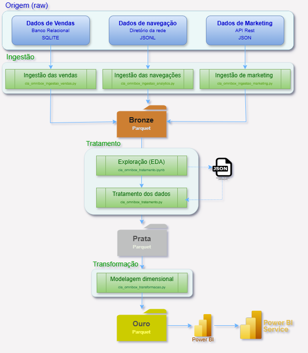

- [Resumo do projeto](#resumo-do-projeto)
  - [🎯Objetivo](#objetivo)
  - [🔗Links rápidos](#links-rápidos)
    - [📊 Publicação do dashboard (Power BI Service)](#-publicação-do-dashboard-power-bi-service)
    - [🗎 Meu curriculum vitae](#-meu-curriculum-vitae)
    - [🗎 Modelos de dados das fontes originais (raw)](#-modelos-de-dados-das-fontes-originais-raw)
    - [🗎 Notebook de exploração dos dados](#-notebook-de-exploração-dos-dados)
    - [🗎 Arquivo de configuração (json) com os parametros para tratamento dos dados](#-arquivo-de-configuração-json-com-os-parametros-para-tratamento-dos-dados)
    - [🗎 Programa de tratamento dos dados](#-programa-de-tratamento-dos-dados)
    - [🗎 Programa de transformação dos dados para o modelo dimensional](#-programa-de-transformação-dos-dados-para-o-modelo-dimensional)
    - [🗎 Modelos de dados após transformação para o modelo dimensional (Ouro)](#-modelos-de-dados-após-transformação-para-o-modelo-dimensional-ouro)
    - [🗎 Medidas DAX utilizadas no Dashboard](#-medidas-dax-utilizadas-no-dashboard)
    - [🗎 Documento de Insights](#-documento-de-insights)
  - [🌐 Visão geral](#-visão-geral)
    - [Fluxo dos dados](#fluxo-dos-dados)
- [Contextualização](#contextualização)
  - [👨‍💼 Solicitação](#-solicitação)
  - [📅 Planejamento](#-planejamento)
- [Etapas do processo de análise (CRISP-DM)](#etapas-do-processo-de-análise-crisp-dm)
  - [Etapa 1: Entendimento do Negócio](#etapa-1-entendimento-do-negócio)
    - [📋**Levantamentos**](#levantamentos)
      - [Informações levantados em e-mails, chats e reuniões de entendimento do negócio com a área solicitante e/ou demais áreas relacionadas.](#informações-levantados-em-e-mails-chats-e-reuniões-de-entendimento-do-negócio-com-a-área-solicitante-eou-demais-áreas-relacionadas)
    - [🖋️ Formalização da entrega](#️-formalização-da-entrega)
  - [Etapa 2: Coleta e Entendimento dos Dados](#etapa-2-coleta-e-entendimento-dos-dados)
    - [Nessa etapa o objetivo é analisar os dados através de:](#nessa-etapa-o-objetivo-é-analisar-os-dados-através-de)
    - [2.1 Documentação de coleta](#21-documentação-de-coleta)
    - [🗎 CLA\_OMNIBOX\_Doc\_Engenharia\_Dados\_v2](#-cla_omnibox_doc_engenharia_dados_v2)
    - [2.2 Definição de Requisitos de Dados](#22-definição-de-requisitos-de-dados)
    - [2.3 Coleta (ingestão)](#23-coleta-ingestão)
    - [2.4 Descrição dos dados coletados](#24-descrição-dos-dados-coletados)
    - [2.5 Análise de adequação e cobertura de dados](#25-análise-de-adequação-e-cobertura-de-dados)
    - [2.6 Análise exploratória dos dados (EDA)](#26-análise-exploratória-dos-dados-eda)
      - [1. Visão Geral e Objetivo](#1-visão-geral-e-objetivo)
      - [2. Arquitetura e Stack Tecnológica](#2-arquitetura-e-stack-tecnológica)
        - [Motor de Processamento](#motor-de-processamento)
        - [Linguagens e Ferramentas](#linguagens-e-ferramentas)
      - [3. Estrutura de Diretórios](#3-estrutura-de-diretórios)
      - [4. Fluxo de Execução](#4-fluxo-de-execução)
      - [4.1. Setup e Configuração Inicial](#41-setup-e-configuração-inicial)
      - [4.2. Carga do Schema (Metadados)](#42-carga-do-schema-metadados)
      - [4.3. Mapeamento Dinâmico de Dados (Bronze → DuckDB)](#43-mapeamento-dinâmico-de-dados-bronze--duckdb)
      - [4.4. Inspeção de Schema e Volumetria](#44-inspeção-de-schema-e-volumetria)
      - [4.5. Validação de Nulos e Campos Obrigatórios](#45-validação-de-nulos-e-campos-obrigatórios)
      - [4.6. Exploração e Análise dos Dados](#46-exploração-e-análise-dos-dados)
  - [Etapa 3: Preparação dos dados](#etapa-3-preparação-dos-dados)
    - [1. Visão Geral e Arquitetura](#1-visão-geral-e-arquitetura)
      - [Especificações Técnicas do Motor](#especificações-técnicas-do-motor)
    - [2. Fluxo de Execução e Mapeamento](#2-fluxo-de-execução-e-mapeamento)
    - [3. Matriz de Validações Aplicadas](#3-matriz-de-validações-aplicadas)
      - [3.1. Validações Estruturais e de Formato](#31-validações-estruturais-e-de-formato)
      - [3.2. Validações de Integridade Relacional](#32-validações-de-integridade-relacional)
      - [3.3. Validações de Regras de Negócio Customizadas](#33-validações-de-regras-de-negócio-customizadas)
    - [4. Roteamento de Dados e Tolerância a Falhas](#4-roteamento-de-dados-e-tolerância-a-falhas)
  - [Etapa 4: Modelagem dimensional](#etapa-4-modelagem-dimensional)
      - [🛠️ Stack Tecnológico e Otimizações](#️-stack-tecnológico-e-otimizações)
    - [🔄 Fluxo de Processamento e Dependências (DAG)](#-fluxo-de-processamento-e-dependências-dag)
    - [📊 Modelagem de Dados e Regras de Negócio](#-modelagem-de-dados-e-regras-de-negócio)
      - [1. Dimensões (Tabelas de Busca)](#1-dimensões-tabelas-de-busca)
      - [2. Fatos (Tabelas Transacionais)](#2-fatos-tabelas-transacionais)
      - [3. Agregações e Snapshots (Modelos Analíticos)](#3-agregações-e-snapshots-modelos-analíticos)
    - [🚦 Orquestração e Telemetria](#-orquestração-e-telemetria)
  - [Etapa 5: Construção e validação](#etapa-5-construção-e-validação)
    - [Design e Interface (UI/UX)](#design-e-interface-uiux)
      - [Conceito Visual](#conceito-visual)
      - [Arquitetura de Informação](#arquitetura-de-informação)
    - [Medidas](#medidas)
  - [Etapa 6: Publicação](#etapa-6-publicação)
      - [📊 Publicação do dashboard (Power BI Service)](#-publicação-do-dashboard-power-bi-service-1)

# Resumo do projeto

## 🎯Objetivo 

Análise de ciclo de vida do cliente (CLA) sobre base de dados de operação de e-commerce de uma empresa fictícia de cosméticos chamada Omnibox.   

Este projeto foi criado como parte do meu portfólio de análise de dados para demonstrar habilidades em: 
- _Domínio do entendimento do problema, planejamento da análise e organização das atividades_
- _Trabalho com fontes e formatos de dados variados: csv, json/jsonl (API), DB relacional (SQL) e parquet_ 
- _Habilidade de trabalho com grandes volumes de dados_ 
- _Domínio de técnicas de engenharia, ingestão, tratamento e transformação de dados_
- _Programação avançada em Python/SQL e versionamento profissional com git_
- _Desenvolvimento de dashboard no PowerBI com design 'premium_' 
- _Apuração e apresentação de insights e storytelling baseado nos dados_
## 🔗Links rápidos
### 📊 [Publicação do dashboard (Power BI Service)](https://app.powerbi.com/view?r=eyJrIjoiNGJhMGJjNWYtM2U1YS00NWJlLTkyZmYtYzQ5YjAwODg4MjY2IiwidCI6IjNmZDRlZDcxLWNmMDUtNDJmMS05Y2ZjLWQyNGI5ZGFjZjA3MyJ9)  

### 🗎 [Meu curriculum vitae](./docs/CV_Sergio_Ribeiro_AD_BI.pdf) 

### 🗎 [Modelos de dados das fontes originais (raw)](./docs/CLA_OMNIBOX_Doc_Engenharia_Dados_v2.pdf)

### 🗎 [Notebook de exploração dos dados](./src/cla_omnibox_exploracao.ipynb)

### 🗎 [Arquivo de configuração (json) com os parametros para tratamento dos dados](./config/cla_omnibox_schema_dados.json)

### 🗎 [Programa de tratamento dos dados](./src/cla_omnibox_tratamento.py)

### 🗎 [Programa de transformação dos dados para o modelo dimensional](./src/cla_omnibox_transformacao.py)

### 🗎 [Modelos de dados após transformação para o modelo dimensional (Ouro)](./docs/CLA_OMNIBOX_Doc_Analise_Esquema_Ouro.pdf)

### 🗎 [Medidas DAX utilizadas no Dashboard](./docs/CLA_OMNIBOX_Doc_Analise_Medidas_DAX.pdf)

### 🗎 [Documento de Insights](./docs/CLA_OMNIBOX_Doc_Analise_Insights.pdf)

## 🌐 Visão geral 
### Fluxo dos dados
  - 

# Contextualização  

## 👨‍💼 Solicitação 

**De:** Ricardo Souza – Diretor de E-commerce (OmniBox S.A.)  
**Para:** Equipe de Análise de Dados  
**Assunto:** Urgente: Diagnóstico de Eficiência de Vendas e Retenção (Projeto CLA)

Olá,
Nossa operação de e-commerce cresceu 25% no último ano, **mas o lucro líquido não acompanhou esse ritm**o.
Tenho a sensação de que estamos gastando muito para atrair **clientes que compram apenas uma vez** e nunca mais voltam.

Além disso, nossa equipe de marketing não consegue dizer com clareza **qual canal traz o cliente mais valioso a longo prazo**.

Hoje, nossos **dados estão espalhados**: as vendas estão no ERP (PostgreSQL), o comportamento de navegação em arquivos de log e o investimento em marketing em planilhas à parte.

Para o planejamento do próximo semestre, preciso de um diagnóstico profundo do nosso Ciclo de Vida do Cliente (CLA).

Especificamente, preciso que respondam:

**Saúde do Funil**: Onde estamos perdendo mais usuários? Desde a navegação até o checkout, **qual o nosso maior gargalo?**

**Qualidade da Aquisição:** Quanto estamos pagando por cliente (CAC) e em quanto tempo esse investimento se paga?

**Fidelização e Churn:** Qual o comportamento de recompra? Estamos perdendo clientes ativos? Quero ver isso por grupos de entrada (Cohort).

**Valor do Cliente:** Qual o LTV médio e quem são nossos "**clientes de ouro**" vs. os que só compram em promoção? (**Análise RFM**).

O objetivo final é parar de "atirar para todos os lados" e **focar os investimentos onde há maior retorno**.

Aguardo uma proposta de como vocês pretendem estruturar essa análise.

Atenciosamente,
Ricardo Souza

## 📅 Planejamento

**De:** Sergio Ribeiro Cerqueira - Equipe de Análise de Dados

**Para:** Ricardo Souza – Diretor de E-commerce

**Assunto**: RE: Urgente: Diagnóstico de Eficiência de Vendas e Retenção (Projeto CLA)

Olá, Ricardo. Recebemos sua solicitação.

Segue a estruturação das etapas do plano de ação para o projeto de **CLA da Omnibox**:

1.  **Entendimento e Alinhamentos Gerais:** Realizaremos o *kick-off*  e as comunicações necessárias para definir KPIs, fórmulas de cálculo (ex: CAC, LTV), perguntas de negócio, critérios de aceite (DoD) e forma de entrega com o objetivo de elaborar e aprovar o “**Termo de abertura do projeto” (TAP)**.
2.  **Mapeamento e Compreensão de Dados:**  Localização e exploração das fontes (ERP, Logs e API) para entender como se conectam.
3.  **Centralização e Tratamento:** Criação de uma base única e confiável, tratando inconsistências para garantir um diagnóstico preciso.
4.  **Análise de Dados:** Execução das análises com foco nas respostas às perguntas levantadas no briefing.
5.  **Camadas de Apresentação:** Desenvolvimento de dashboards no Power BI e relatórios executivos.
6.  **Testes e Aprovações:** Validação técnica e de negócio.
7.  **Deploy:** Entrega final e apresentação dos insights.

**Nota 1:** A execução será **cíclica**. Conforme o método CRISP-DM, poderemos retornar a etapas anteriores para correções de rota sempre que novos insights surgirem.

**Nota 2:** Utilizaremos o método **SCRUM** para organização e controle das atividades, garantindo entregas incrementais e alinhamento constante com as prioridades do negócio.

# Etapas do processo de análise (CRISP-DM) 

## Etapa 1: Entendimento do Negócio

### 📋**Levantamentos** 

#### Informações levantados em e-mails, chats e reuniões de entendimento do negócio com a área solicitante e/ou demais áreas relacionadas.

- **Pontos chave para o sucesso da entrega.**

Ter certeza de que os dados do ERP e os Logs de Navegação estão "falando a mesma língua”.  
Saber qual canal de marketing (Google, Meta, etc.) traz o cliente que se paga mais rápido. 
Lista clara de "Clientes em Risco" para passarmos ao time de CRM. 
Dashboard deve mostrar claramente onde está o gargalo do funil para priorizarmos o investimento

- **Detalhes do negócio, termos técnicos, indicadores e fórmulas de cálculo.**

  - Consideramos como "venda" apenas pedidos com status **"Faturado"** (ignorar cancelados/boletos expirados).
  - **Churn:** Definimos como um cliente que não realiza uma nova compra há mais de **90 dias**.
  -**LTV (Lifetime Value):** Soma da receita líquida gerada pelo cliente num período histórico de **12 meses**.
  - **CAC (Custo de Aquisição):** Total gasto em anúncios (Ads) / Total de novos clientes (Primeira compra).
  - **RFM:** Queremos uma pontuação de **1 a 5** para cada pilar. O "Valor Monetário" deve ser baseado no Ticket Médio acumulado.
  - **Etapas do Funil:** Visualização de Produto → Adição ao Carrinho → Inicio do checkout → Compra finalizada.

- **Quais perguntas o solicitante espera que os dados respondam.**

    - **Eficiência de Marketing:** "Para cada R$ 1,00 investido no Canal X, quanto de lucro (não apenas receita) retorna em 6 meses?"

    - **Gargalo de Conversão:** "Onde está a maior 'fuga' de dinheiro: no carregamento da página, na visualização do produto ou no checkout de pagamento?"

    - **Saúde da Base:** "Nossos clientes antigos estão comprando mais ou estamos sobrevivendo apenas de 'sangue novo' (novos clientes)?"

    - **Segmentação de Ouro:** "Quem são os 10% de clientes que geram 50% do nosso faturamento e quais produtos eles costumam comprar?"

    - **Previsão de Risco:** "Quais comportamentos de navegação indicam que um cliente fiel está prestes a se tornar Churn (parar de comprar)?" ****

- **Fontes importantes para entendimento dos dados (pessoas,  documentos, sites, etc.).**
- **Alinhamentos sobre critérios de aceite e forma de entrega. (DoD)**

### 🖋️ Formalização da entrega

__Fica alinhado que a entrega consistirá em uma Auditoria Estratégica Retrospectiva referente a 24 meses de operação.  
O escopo contempla a construção de um pipeline de dados estruturado em arquitetura Medallion (camadas Bronze a Gold), a disponibilização de um painel focado em Customer Lifecycle Analysis (CLA) e a apresentação de insights direcionados ao planejamento macro e à saúde a longo prazo do negócio. __ 

## Etapa 2: Coleta e Entendimento dos Dados

### Nessa etapa o objetivo é analisar os dados através de:

- Acesso aos dados e documentações.
- Verificar se os dados cobrem as necessidades das analises
- Entendimento do formato e estrutura dos dados (entidades, campos, chaves, cardinalidade, etc.).
- Verificação da consistência e necessidade de tratamento dos dados.
- Mapeamento dos dados  necessários pra atender os objetivos do projeto.

### 2.1 Documentação de coleta

Documentação do dicionário de dados e origens de coleta fornecidas pela equipe de engenharia de dados. 

### 🗎 [CLA_OMNIBOX_Doc_Engenharia_Dados_v2](./docs/CLA_OMNIBOX_Doc_Engenharia_Dados_v2.pdf)

### 2.2 Definição de Requisitos de Dados

Elaboração de mapeamento conceitual dos dados necessários para as análises, com base nas documentações. 

Aqui é feita a ponte entre a documentação fornecida e as necessidades de dados para atender ás expectativas de analises. 

link:  omnibox_cla_mapa_requisitos_dados.pdf  **(gerar link)**

### 2.3 Coleta (ingestão)

Os dados disponibilizados são **multi-origem** e terão 3 formas de coleta diferentes implementadas em programas Python simples: 

1. **omnibox_cla_carga_vendas.py :** 
    
    *Busca os dados das tabelas de vendas no banco de dados PostgreSQL do ERP e salva em formato “parquet” no diretório especificado nas configurações do programa.*  
    
2. **omnibox_cla_carga_navegacao.py**
    
    Lê os dados nos arquivos CSV disponibilizados *e salva em formato “parquet” no diretório especificado nas configurações do programa.*  
    
3. **omnibox_cla_carga_maketing.py**
    
    *Chama métodos da API Rest do sistema de marketing  para buscar os dados e  salvar em formato “parquet” no diretório especificado nas configurações do programa.*
    

**Disponibilização da coleta**

Ao final de todas as ingetões os resultados estarão padronizados no formato ‘**parquet**’ (um para cada arquivo/tabela) e disponibilizados em um diretório único. 

Estes serão os dados brutos (padrão bronze) disponibilizados para tratamento e análise.

### 2.4 Descrição dos dados coletados

Aqui analiso os dados coletados (relacionamentos, PK,  FK, campos requeridos e etc.) , e monto um desenho do modelo de dados.  

Este modelo servirá de base para as analises exploratorias e a configuração dos tratamentos de dados que serão descritos no arquivo [cla_omnibox_schema_dados.json](./config/cla_omnibox_schema_dados.json)

### 2.5 Análise de adequação e cobertura de dados

Nessa etapa verifico se os dados necessários pra atender os objetivos do projeto estão disponíveis nos dados disponibilizados. 

Caso não estejam volto alguns passos pra entender se houve algum gap na engenharia, carga ou documentações.

⚠️ **__Em caso de campos faltantes ou dados de baixa qualidade para responder a alguma pergunta, procuro confirmar se a coleta foi feita corretamente e se o “gap” persistir, volto para a Etapa 1 para renegociar o escopo com o cliente e fazer os adendos necessários no TAP (termo de abertura do projeto).__**

### 2.6 Análise exploratória dos dados (EDA)

#### 1. Visão Geral e Objetivo

Nesta etapa tem como objetivo realizar a exploração inicial dos dados, padronização de formatos e execução de análises diagnósticas na camada Bronze do Data Lake.

O processo contempla:

- Inspeção estrutural dos dados
- Validações iniciais de qualidade
- Preparação para etapas posteriores do pipeline (Data Quality)

A abordagem adotada combina processamento analítico em memória com exploração visual orientada a amostras.

O Notebook que implementa a exploração dos dados é o [cla_omnibox_exploracao.ipynb](./src/cla_omnibox_exploracao.ipynb)

#### 2. Arquitetura e Stack Tecnológica

##### Motor de Processamento
- **DuckDB** (Processamento analítico colunar em memória)

##### Linguagens e Ferramentas
- **Python 3**
- **Pandas** (manipulação e visualização tabular)
- **Jupyter Notebook**

#### 3. Estrutura de Diretórios

O pipeline utiliza uma organização padronizada de diretórios:

- `raw/` → dados brutos
- `bronze/` → dados tratados iniciais
- `prata/` → dados validados (output esperado)
- `config/` → regras e schema (`cla_omnibox_schema_dados.json`)

#### 4. Fluxo de Execução

O notebook segue um fluxo estruturado em etapas sequenciais:

#### 4.1. Setup e Configuração Inicial

Responsável por preparar o ambiente de execução:

- Importação de bibliotecas
- Configuração de visualização (Pandas e Seaborn)
- Inicialização do DuckDB em memória
- Aplicação de limites de hardware
- Definição de caminhos de diretórios

#### 4.2. Carga do Schema (Metadados)

Leitura do arquivo mestre:

- `cla_omnibox_schema_dados.json`

Funções desta etapa:

- Carregar estrutura esperada das tabelas
- Identificar colunas e tipos esperados
- Definir base para validações posteriores

#### 4.3. Mapeamento Dinâmico de Dados (Bronze → DuckDB)

Criação automática de **views no DuckDB** a partir dos arquivos `.parquet`.

#### 4.4. Inspeção de Schema e Volumetria

Análise comparativa entre:
- Estrutura física (DuckDB)
- Estrutura lógica (JSON)
  
Validações realizadas:
- Contagem de registros por tabela
- Quantidade de colunas
- Comparação de colunas esperadas vs reais

Possíveis status: 
✅ OK → Estrutura consistente
⚠️ Divergente → Diferenças detectadas
❌ Pendente → Dados não encontrados

#### 4.5. Validação de Nulos e Campos Obrigatórios

Verificação de integridade básica:
- Campos obrigatórios (NOT NULL)
- Strings vazias
- Dados inconsistentes

*Objetivo* :
Identificar falhas críticas logo na exploração inicial

#### 4.6. Exploração e Análise dos Dados

Uso de:
Pandas → agregações e amostras
Tipos de análise:
- Distribuição de dados
- Outliers
- Padrões de comportamento
- Estatísticas descritivas

## Etapa 3: Preparação dos dados

### 1. Visão Geral e Arquitetura

Esta etapa é onde faço o tratamento e roteamento dos dados na transição da camada Bronze (dados brutos/brutos particionados) para a camada Prata (dados confiáveis e higienizados).

A arquitetura de validação foi desenhada de maneira orientada a metadados, o que significa que o código Python não possui regras "chumbadas". Em vez disso, o motor lê as regras de negócio e restrições a partir de um arquivo mestre de configuração chamado  
[cla_omnibox_schema_dados.json](./config/cla_omnibox_schema_dados.json), garantindo alta escalabilidade e fácil manutenção.

O programa que implementa os tratamentos é o [cla_omnibox_tratamento.py](./src/cla_omnibox_tratamento.py)

#### Especificações Técnicas do Motor

- **Motor de Processamento:** DuckDB (Processamento Analítico Colunar em Memória)  
- **Otimização de Hardware:** Limite de 6GB de RAM e processamento distribuído em 8 threads para garantir estabilidade operacional  
- **Linguagem Orquestradora:** Python 3  

### 2. Fluxo de Execução e Mapeamento
O pipeline opera sob um fluxo contínuo e automatizado que identifica a tipologia da fonte de dados antes de iniciar o processamento:

- **Mapeamento Dinâmico:** O script varre o diretório Bronze e identifica automaticamente se a fonte de dados é um arquivo único (ex: `orders.parquet`) ou um diretório particionado (ex: `google_analytics/*.parquet`)  
- **Criação de Views:** Para otimizar a leitura e não sobrecarregar a memória, são criadas *views* virtuais no DuckDB que apontam diretamente para os arquivos físicos  

### 3. Matriz de Validações Aplicadas

Antes de um registro ser promovido para a camada Prata, ele é submetido a uma rigorosa esteira de auditoria dividida em quatro frentes estruturais:

#### 3.1. Validações Estruturais e de Formato

- **Schema e Volumetria:** Comparação estrita entre a estrutura física mapeada pelo DuckDB e as colunas esperadas pelo JSON Mestre (detectando colunas faltantes ou excedentes)  
- **Tipagem, Nulos e Brancos:** Garantia de que campos obrigatórios (NOT NULL) não contenham valores nulos ou strings vazias, além da verificação de compatibilidade de tipos (Inteiros, Datas, Strings, etc.)  
- **Regex e Qualidade Numérica:** Validação de padrões de string via Expressões Regulares e bloqueio de anomalias numéricas (ex: preços negativos ou zerados indevidamente)  
- **Domínio de Dados:** Validação contra uma lista estática de categorias aceitas (evitando erros de digitação sistêmica)  

#### 3.2. Validações de Integridade Relacional

- **Chaves Primárias (PK):** Teste de unicidade para chaves primárias simples e compostas, garantindo a ausência de registros duplicados absolutos  
- **Chaves Estrangeiras (FK):** Verificação de integridade referencial para garantir que não existam registros "órfãos" (ex: um pedido atrelado a um cliente que não existe na tabela `customers`)  

#### 3.3. Validações de Regras de Negócio Customizadas

- **Consistência Financeira:** Aplicação de lógicas em SQL para validações complexas. O pipeline realiza a conciliação automática cruzando o valor total cobrado no cabeçalho do pedido (`gross_amount` na tabela `orders`) com a soma bruta da quantidade multiplicada pelo preço unitário dos itens (`price * quantity` na tabela `order_items`), considerando os descontos aplicados  

### 4. Roteamento de Dados e Tolerância a Falhas

O pipeline implementa o padrão arquitetural de **Dead Letter Queue (DLQ)** e **Circuit Breaker** para garantir a confiabilidade do Data Lake:

- **Promoção (Camada Prata):** Registros que passam em 100% das regras de validação são consolidados e gravados no diretório da camada Prata  
- **Quarentena (DLQ):** Registros que violam qualquer regra são isolados e gravados em um diretório de Quarentena (`_dlq.parquet`), impedindo a contaminação da base analítica principal, mas preservando o dado para futura auditoria e correção  
- **Circuit Breaker (Proteção Sistêmica):** O arquivo de configuração mestre define uma taxa de tolerância a erros (em percentual) para cada tabela. Se a proporção de registros defeituosos em relação ao volume lido superar essa tolerância, o pipeline aciona um alarme de falha crítica e interrompe o processamento, impedindo que uma carga massivamente corrompida seja processada  

## Etapa 4: Modelagem dimensional

O módulo de transformação ([cla_omnibox_transformacao.py](./src/cla_omnibox_transformacao.py)) é o motor analítico do projeto.  
Ele é responsável por consumir os dados higienizados da **Camada Prata** e aplicar regras complexas de negócio para gerar a **Camada Ouro** (Modelagem Dimensional e Agregações Analíticas), que alimenta diretamente os dashboards no Power BI.

#### 🛠️ Stack Tecnológico e Otimizações
* **Motor de Processamento:** DuckDB executando consultas analíticas em memória.
* **Formato de Armazenamento:** Apache Parquet, garantindo alta compressão e leitura colunar ultra-rápida.
* **Controle de Recursos:** O limite de memória do DuckDB é explicitamente travado em `4GB` (`PRAGMA memory_limit='4GB'`) para garantir estabilidade operacional em ambientes com recursos restritos.

### 🔄 Fluxo de Processamento e Dependências (DAG)

A execução das rotinas obedece a uma ordem de dependência estrita, pois diversas tabelas da Camada Ouro são utilizadas como insumo (`JOINs` e `CTEs`) para a construção de modelos subsequentes. 

O orquestrador processa os dados na seguinte sequência:

1. **Dimensões Base:** Calendário, Produtos, Marketing Ações.
2. **Dimensão Avançada:** Clientes (depende do cruzamento com web analytics e campanhas).
3. **Tabelas Fato:** Vendas e Marketing (dependem das dimensões base e clientes).
4. **Modelos Analíticos (Agregações):** RFM Snapshot, Estatísticas Mensais, Navegação e Estatísticas de Marketing (dependem das Fatos geradas).

### 📊 Modelagem de Dados e Regras de Negócio

Abaixo estão detalhados os modelos gerados pelo pipeline:

#### 1. Dimensões (Tabelas de Busca)
As dimensões fornecem o contexto necessário para as métricas, permitindo filtros e segmentações detalhadas.

| Tabela | Descrição e Regras Aplicadas |
| :--- | :--- |
| **Calendário** | Tabela de referência temporal contendo atributos de data, ano, mês e chaves compostas para suporte a filtros cronológicos e cálculos de inteligência de tempo. |
| **Produtos** | Dimensão desnormalizada que consolida informações de categoria, subcategoria e o nome do produto em uma única estrutura, facilitando a navegação e hierarquia no dashboard. |
| **Clientes** | Base enriquecida que identifica o canal de origem (tráfego), a ação de marketing vinculada e a data da primeira compra, permitindo o rastreamento do ciclo de vida desde a aquisição. |
| **RFM Legenda** | Tabela auxiliar que armazena a classificação dos segmentos (ex: Campeões, Em Risco), descrições de comportamento e recomendações acionáveis para cada perfil. |
| **Marketing Ações** | Consolida as características das campanhas, incluindo objetivos, canais de mídia utilizados e os períodos de vigência das ações promocionais. |

---

#### 2. Fatos (Tabelas Transacionais)
Tabelas que registram os eventos quantitativos da operação em seu menor nível de detalhe.

| Tabela | Descrição e Regras Aplicadas |
| :--- | :--- |
| **Vendas** | Fato consolidada a nível de item, contendo o status de venda para filtragem de pedidos concluídos. Calcula métricas financeiras críticas como receita líquida, lucro, rateios de frete e o tempo decorrido desde a primeira compra. |

---

#### 3. Agregações e Snapshots (Modelos Analíticos)
Modelos pré-processados e otimizados para garantir rapidez nas visualizações e nos cálculos complexos.

| Tabela | Descrição e Regras Aplicadas |
| :--- | :--- |
| **RFM Snapshot** | Snapshot histórico mensal que armazena os scores individuais de Recência, Frequência e Valor, além da classificação final do cliente baseada no tempo de inatividade. |
| **Estatísticas Mensais** | Tabela de alta performance que agrega volumetria de clientes (novos, ativos e recorrentes) cruzada com faturamento e lucro total por referência mensal. |
| **Estatísticas Marketing** | Modelo focado em ROI que correlaciona faturamento e lucro com o investimento (gasto) por campanha, calculando automaticamente o payback em dias e meses. |
| **Navegação** | Agrega o comportamento do usuário no funil de vendas, registrando a etapa alcançada, a quantidade de sessões únicas e a taxa de abandono em cada ponto do fluxo. |

### 🚦 Orquestração e Telemetria

O pipeline é encapsulado na função `executar_transformacao_ouro()`, que atua como um orquestrador resiliente:
* Cada etapa é cronometrada individualmente.
* Falhas em uma tabela específica são capturadas via bloco `try-except`, evitando a quebra abrupta de todo o pipeline.
* Ao final da execução, um log estruturado em formato JSON é retornado e impresso, contendo o status geral, contagem de tabelas processadas e o tempo gasto (em segundos) por rotina.

## Etapa 5: Construção e validação

### Design e Interface (UI/UX)

O projeto **Omnibox Cosméticos** foi desenvolvido com foco em uma experiência de usuário (UX) intuitiva e uma interface (UI) moderna, utilizando o conceito de **Neumorfismo (Soft UI)**.

#### Conceito Visual
* **Estilo Neumórfico:** Utilização de sombras suaves e camadas para criar profundidade, dando aos elementos uma aparência de "baixo-relevo" que se integra organicamente ao fundo.
* **Paleta de Cores:** Baseada em tons de roxo profundo e azul marinho, transmitindo sofisticação e elegância (alinhado ao nicho de cosméticos), com acentos em dourado e creme para facilitar a leitura e destacar KPIs críticos.
* **Tipografia e Hierarquia:** Uso de fontes sem serifa e contrastes de peso para guiar o olhar do tomador de decisão, priorizando métricas de variação percentual (Δ Ano anterior).
  
*Ferramenta utilizada:*  
Para desenho do visual 'premium' das telas do dashboard foi utilizada a ferramenta gratuíta FIGMA.

#### Arquitetura de Informação
O dashboard está estruturado em quatro visões estratégicas que permitem uma análise completa do funil de vendas e saúde do cliente:

1.  **Visão Executiva (Executive Summary):** Concentra os KPIs de alto nível (Faturamento, ROAS, Churn, CAC). Ideal para uma leitura rápida da saúde financeira e operacional.
2.  **Marketing & Performance:** Focado na alocação de recursos por canal (Google, Facebook, Instagram, TikTok). Inclui métricas de eficiência como Payback e Retorno por Real Investido.
3.  **Retenção & CRM:** Utiliza segmentação RFM (Recência, Frequência e Valor) para classificar a base de clientes em perfis (Fiéis, Em Risco, Hibernando), permitindo estratégias de reativação direcionadas.
4.  **Funil de Conversão:** Analisa o comportamento do usuário desde a sessão inicial até o checkout final, identificando gargalos técnicos e de experiência de compra por dispositivo e região.

### Medidas

AS medidas utilizadas no dashboard estão no documento [CLA_OMNIBOX_Doc_Analise_Medidas_DAX.pdf](./docs/CLA_OMNIBOX_Doc_Analise_Medidas_DAX.pdf)

## Etapa 6: Publicação 

#### 📊 [Publicação do dashboard (Power BI Service)](https://app.powerbi.com/view?r=eyJrIjoiNGJhMGJjNWYtM2U1YS00NWJlLTkyZmYtYzQ5YjAwODg4MjY2IiwidCI6IjNmZDRlZDcxLWNmMDUtNDJmMS05Y2ZjLWQyNGI5ZGFjZjA3MyJ9)

